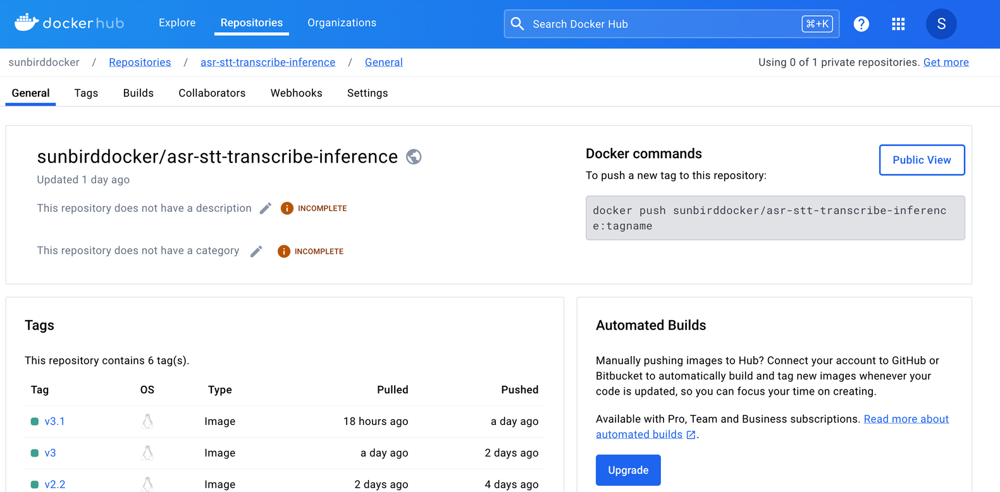

# Inference Deployment on RunPod and Integration with Sunbird AI API


## Overview

RunPod is a cloud computing platform designed for AI, machine learning applications, and general compute.

Execute your code utilizing both GPU and CPU resources through [Pods](https://docs.runpod.io/pods/overview), as well as [Serverless](https://docs.runpod.io/serverless/overview) computing options.

### What are Pods?​

**Pods** allows you to run your code on GPU and CPU instances with containers.

Pods are available in two different types: [Secure Cloud and Community](https://docs.runpod.io/references/faq/#secure-cloud-vs-community-cloud) Cloud. The Secure Cloud runs in T3/T4 data centers providing high reliability and security, while the Community Cloud connects individual compute providers to consumers through a vetted, secure peer-to-peer system.

### What is Serverless?​

**Serverless** offers pay-per-second serverless GPU computing, bringing autoscaling to your production environment. The Serverless offering allows users to define a Worker, create a REST API Endpoint for it which queue jobs and autoscales to fill demand. This service, part of the Secure Cloud offering, guarantees low cold-start times and stringent security measures.

### What are AI APIs?​

**AI APIs** are fully managed and Endpoints of some of the most popular AI models.

### CLI​

Additionally, RunPod has developed a Command Line Interface (CLI) tool designed specifically for quickly developing and deploying custom endpoints on the RunPod serverless platform.

## Manage accounts

You will need to create an account or get invited by a team member to use RunPod. Sign up for an account at [RunPod.io](https://www.runpod.io/).

To for advanced account and permissions management you can follow this link [here](https://docs.runpod.io/get-started/manage-accounts).

### Connect to RunPod

There are many ways to interact with RunPod:

- Web interface

- CLI

- SDKs

## Installing and configuring runpodctl

**runpodctl** is an [open-source command-line interface (CLI)](https://github.com/runpod/runpodctl). You can use runpodctl to work with Pods and RunPod projects. Follow this [link](https://docs.runpod.io/cli/install-runpodctl) to be able to install and configure runpod CLI tool.

### RunPod Serverless

RunPod offers Serverless GPU computing for AI inference, training, and general compute, allowing users to pay by the second for their compute usage. This flexible platform is designed to scale dynamically, meeting the computational needs of AI workloads from the smallest to the largest scales.

For more details follow this [link](https://docs.runpod.io/serverless/overview).

How to interact with RunPod Serverless?​

RunPod generates an Endpoint Id that that allows you to interact with your Serverless Pod. Pass in your Endpoint Id to the Endpoint URL and provide an operation.

This Endpoint URL will look like this:

`https://api.runpod.ai/v2/{endpoint_id}/{operation}`

- `api.runpod.ai`: The base URL to access RunPod.

- `v2`: The API version.

- `endpoint_id`: The ID of the Serverless Endpoint.

- `operation`: The operation to perform on the Serverless Endpoint.

    - Valid options: `run` | `runsync` | `status` | `cancel` | `health` | `purge-queue`


## Runpod workers

### Overview​

You'll have an understanding of building a Docker image, deploying a Serverless endpoint, and sending a request. You'll also have a basic understanding of how to customize the handler for your use case.

### Prerequisites​

This section presumes you have an understanding of the terminal and can execute commands from your terminal.

### RunPod​

To continue with this quick start, you'll need the following from RunPod:

- RunPod account

- RunPod API Key

### Docker​

To build your Docker image, you'll need the following:

- [Docker](https://www.docker.com/products/docker-desktop/) installed

- [Docker hub](https://hub.docker.com/signup) account

Reach out to the team to get Sunbird AI docker hub crdentials.

### GitHub​

To clone the [runpod-worker-template](https://github.com/SunbirdAI/runpod-worker-template) repo, you'll need access to the following:

- Git installed

- Permissions to clone GitHub repos

### Build and push your Docker image​

This step will walk you through building and pushing your Docker image to your container registry. This is useful to building custom images for your use case.

1. Clone the [worker-template]((https://github.com/SunbirdAI/runpod-worker-template)):

```sh
gh repo clone runpod-workers/worker-template your-local-repo-name
```

**OR**

```sh
git clone https://github.com/SunbirdAI/runpod-worker-template.git your-local-repo-name
```

2. Navigate to the root of the cloned repo:

```sh
cd repo-name
```

3. Build the Docker image:

```sh
docker build --platform linux/amd64 --tag <username>/<repo>:<tag> .
```

For the next step, when need to be logged in into the dockerhub account. Run the command below and follow the prompts
to login into the docker hub account

```sh
docker login
```

4. Push your container registry:

```sh
docker push <username>/<repo>:<tag>
```

See the [build](../bin/build) and [push](../bin/push) scipts in the [bin](../bin)

You can just build and push the image to docker hub by running the commands below.

```sh
chmod u+x bin/*
./bin/build
./bin/push
```

**NOTE**

When building your docker image, you might need to specify the platform you are building for. This is important when you are building on a machine with a different architecture than the one you are deploying to.

When building for RunPod providers use `--platform=linux/amd64`.

Now that you've pushed your container registry, you're ready to deploy your Serverless Endpoint to RunPod.


See code repositories below

- [Sunbird ASR-STT Inference](https://github.com/SunbirdAI/sunbird-asr-stt-transcribe-inference)

- [Sunbird Text Translation Inference](https://github.com/SunbirdAI/sunbird-nllb-translate-inference-server)





To learn more see the [tutorials page](https://docs.runpod.io/tutorials/introduction/overview).

### Deploy a Serverless Endpoint​

This step will walk you through deploying a Serverless Endpoint to RunPod. You can refer to this walkthrough to deploy your own custom Docker image.

1. Log in to the [RunPod Serverless console](https://www.runpod.io/console/serverless).

2. Select + **New Endpoint**.

3. Provide the following:

    - Endpoint name.

    - Select a GPU.

    - Configure the number of Workers.

    - (optional) Select **FlashBoot**.

    - (optional) Select a template.

    - Enter the name of your Docker image.

       - For example `<username>/<repo>:<tag>`.

    - Specify enough memory for your Docker image.

4. Select **Deploy**.


### Test Inference Endpoints on Runpod


### Integration of Inference Enpoints with Sunbird AI API

see the runpod [doumentation](https://docs.runpod.io/sdks/overview) on how to use the sdk to make requests to the serverless endpoint.

Here we used the [python sdk](https://docs.runpod.io/sdks/python/overview).

See the Sunbird AI API docs [here](https://sunbird-ai-api-5bq6okiwgq-ew.a.run.app/docs).


#### Transcribe Task


#### Translate Task


