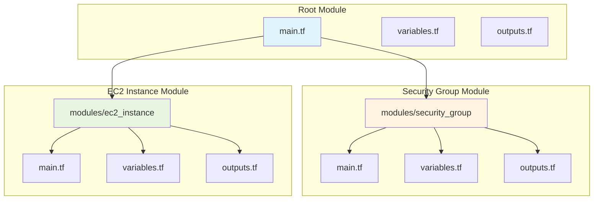
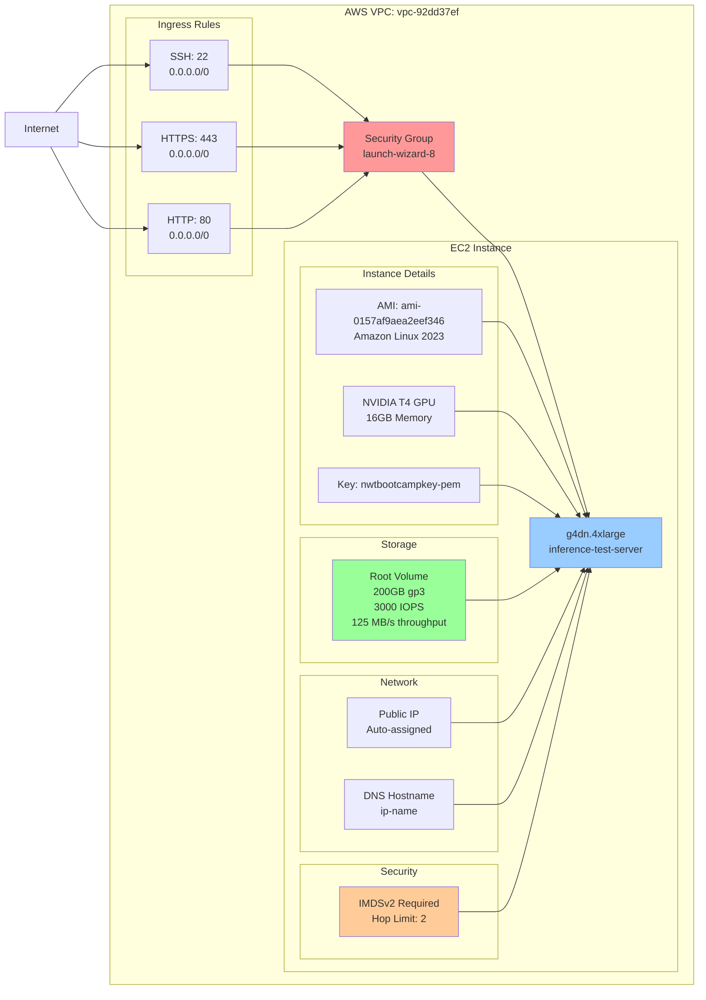
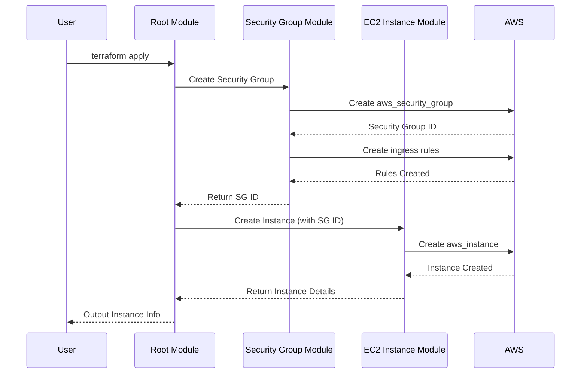
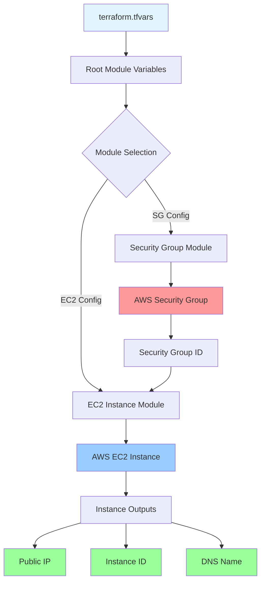
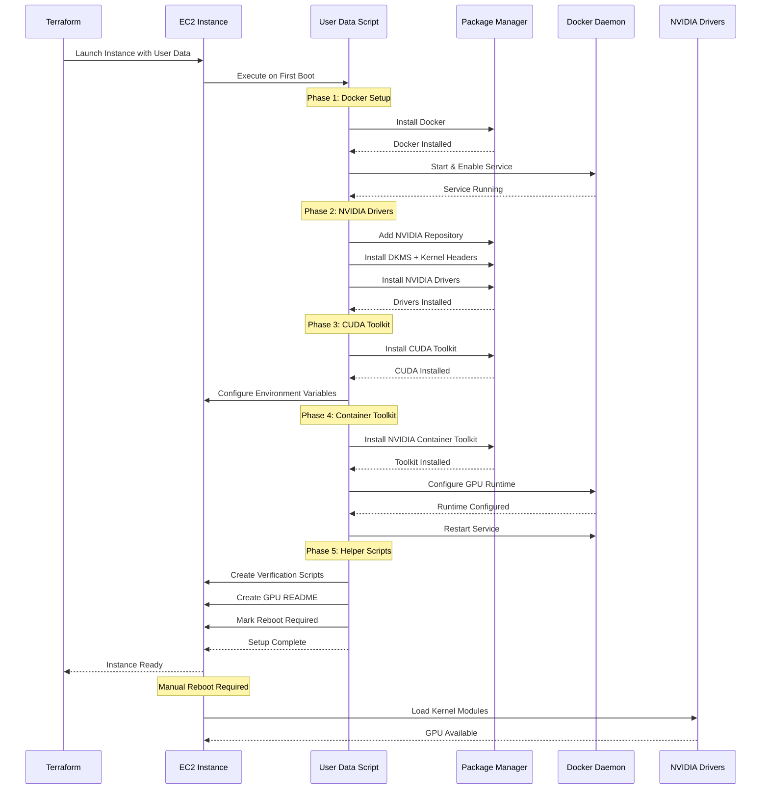
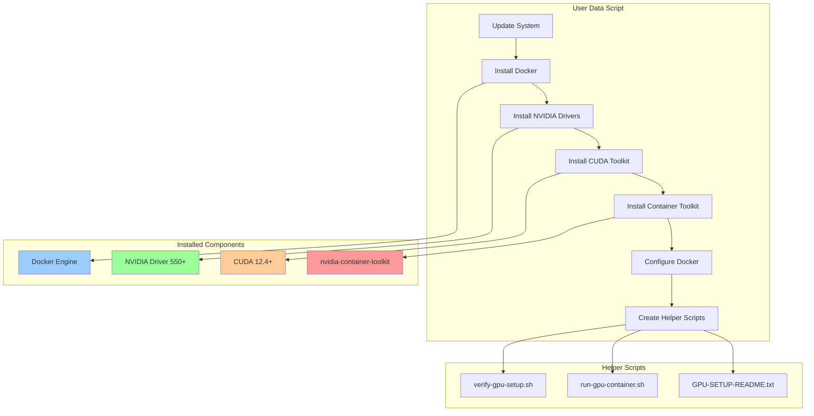

# AWS GPU Instance Architecture

This diagram shows the relationships between Terraform modules and AWS resources.

## Module Dependencies

## AWS Resource Architecture

## Terraform Module Flow

## Data Flow

## GPU Setup Flow (User Data)

## GPU Setup Components

